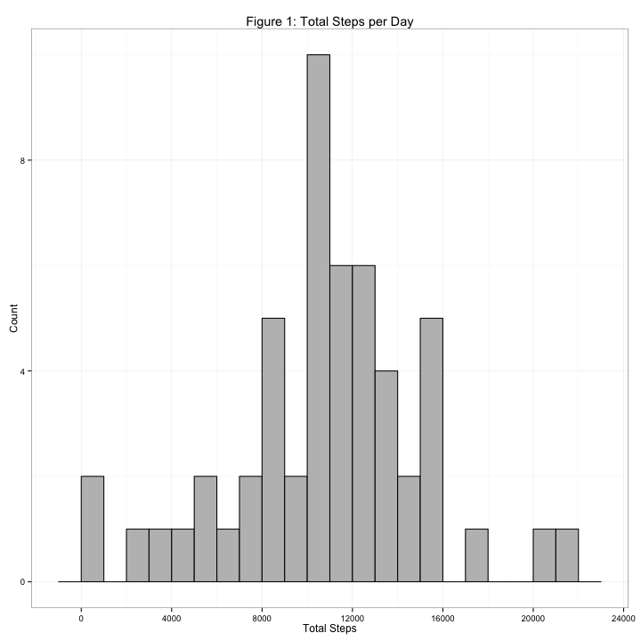
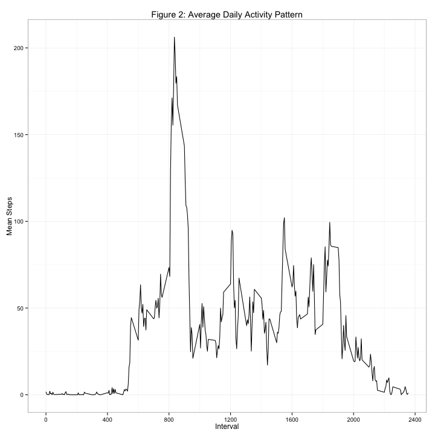
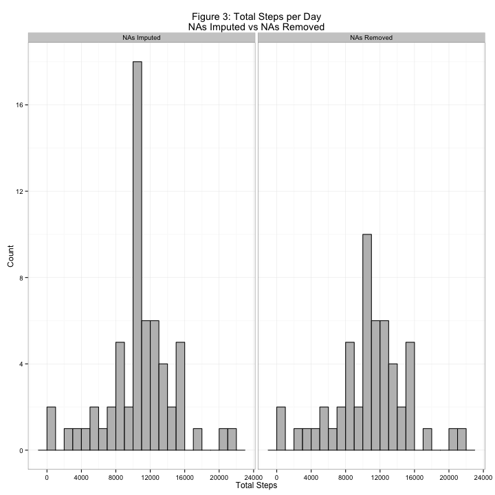
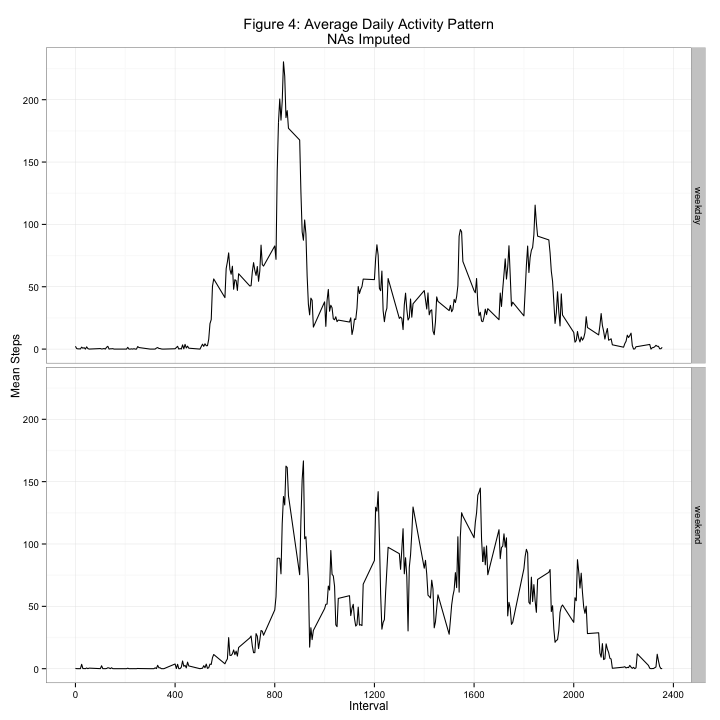

# Reproducible Research: Peer Assessment 1
  
  
## Introduction  
  
This assignment uses data from a personal activity monitoring device.  The device collects data at 5 minute intervals each day.  The data consists of monitoring data from October and November 2012.  
  
Some values are missing from the data.  In the analysis we will analyze both the data with the missing data removed and with the missing data imputed.
  
****
  
## Loading and preprocessing the data  
  
The analysis will require the following packages.  

```r
suppressPackageStartupMessages(library(knitr))
suppressPackageStartupMessages(library(dplyr))
suppressPackageStartupMessages(library(ggplot2))
```
  
First, we load the data.  The data can be retrieved directly from the [Github Repository](https://github.com/crhenderson/RepData_PeerAssessment1).  The following code will also download the data if it is not already in the directory.  If the directory needed is not created, the directory will be created as well.


```r
dir<-"~/Documents/Data Science Coursera/rmarkdown/RepData_PeerAssessment1"
if(!file.exists(dir))
  {dir.create(dir)}
setwd(dir)
url <- "http://d396qusza40orc.cloudfront.net/repdata%2Fdata%2Factivity.zip"
zippath <- file.path(dir,"activity.zip")
if(!file.exists(zippath)) {download.file(url,zippath)}
unzip("activity.zip",file="activity.csv")
activity <- read.csv("activity.csv",header=T)
activity$date <- as.Date(activity$date,'%Y-%m-%d')
```
  
For the first part of the assignment, we will remove all missing data.  

```r
complete <- complete.cases(activity)
activity.nona <- activity[complete,]
```
  
****
  
## What is mean total number of steps taken per day?  
  

```r
total.steps <- activity.nona %>%
  group_by(date)%>%
  summarise(total.steps = sum(steps))
```
  
**Figure 1** shows the histogram for total number of steps taken each day.  

```r
figs<-"~/Documents/Data Science Coursera/rmarkdown/RepData_PeerAssessment1/figures"
if(!file.exists(figs))
  {dir.create(figs)}

png(file.path(figs,"figure1.png"), height=720, width=720)
ggplot(total.steps, aes(x=total.steps)) +
  theme_bw()+
  geom_histogram(binwidth=1000,color="black",fill="grey")+
  scale_x_continuous(breaks=seq(0,25000,4000))+
  scale_y_continuous(breaks=seq(0,20,4))+
  ggtitle("Figure 1: Total Steps per Day")+
  xlab("Total Steps")+
  ylab("Count")
dev.off()
```


The **mean** number of steps taken each day is 10766.19 and the **median** number of steps taken each day is 10765.  


```r
total.steps %>%
  summarise(Number.Days = n(),
            Mean.Steps = mean(total.steps),
            Median.Steps = median(total.steps))%>%
  kable(digits=2)
```


 Number.Days   Mean.Steps   Median.Steps
------------  -----------  -------------
          53     10766.19          10765
  
****
  
## What is the average daily activity pattern?  
  

```r
interval.mean <- activity.nona %>%
  group_by(interval) %>%
  summarise(mean.steps = mean(steps))
```

In **Figure 2** we can see the average number of steps accross each 5 minute interval.  

```r
png(file.path(figs,"figure2.png"), height=720, width=720)
ggplot(interval.mean, aes(x=interval,y=mean.steps))+
  theme_bw()+
  geom_line()+
  scale_x_continuous(breaks=seq(0,2400,400))+
  scale_y_continuous(breaks=seq(0,250,50))+
  ggtitle("Figure 2: Average Daily Activity Pattern")+
  xlab("Interval")+
  ylab("Mean Steps")
dev.off()
```


Interval 835 has the max average number of steps.  

```r
interval.mean[which.max(interval.mean$mean.steps),]%>%
  kable(digits=2)
```


 interval   mean.steps
---------  -----------
      835       206.17
  
****
  
## Imputing missing values  
  
Here we will impute missing values.  First, we can see that 2304 rows have missing values.  
  

```r
missing <- activity[!complete,]
nrow(missing)
```

```
## [1] 2304
```
  
We will impute these missing values with the mean number of steps at the specified 5 minute interval.  This way, we do not effect the mean of the data.  

```r
missing <- merge(missing,interval.mean)
missing$steps <- missing$mean.steps
missing <- missing[,1:3]
activity.imputed <- rbind(activity.nona,missing)
activity.imputed$nas <- "NAs Imputed"
activity.nona$nas <- "NAs Removed"
activity.full <- rbind(activity.imputed,activity.nona)
```


```r
total.steps.comp <- activity.full %>%
  group_by(date,nas)%>%
  summarise(total.steps = sum(steps))
```

**Figure 3** shows histograms for total steps per day for the imputed data vs the removed data.  We can see that the number of steps near the mean number of steps has increased while the rest of the steps are unchanged.  


```r
png(file.path(figs,"figure3.png"), height=720, width=720)
ggplot(total.steps.comp, aes(x=total.steps)) +
  theme_bw()+
  geom_histogram(binwidth=1000,color="black",fill="grey")+
  scale_x_continuous(breaks=seq(0,25000,4000))+
  scale_y_continuous(breaks=seq(0,20,4))+
  facet_grid(.~nas)+
  ggtitle("Figure 3: Total Steps per Day\nNAs Imputed vs NAs Removed")+
  xlab("Total Steps")+
  ylab("Count")
dev.off()
```


With the 8 extra days with imputed data using the interval means we can see that the mean total steps per day is unchanged while the median number of total steps per day increases.  


```r
total.steps.comp %>%
  group_by(NA.Type=nas)%>%
  summarise(Number.Days = n(),
            Mean.Steps = mean(total.steps),
            Median.Steps = median(total.steps))%>%
  kable(digits=2)
```


NA.Type        Number.Days   Mean.Steps   Median.Steps
------------  ------------  -----------  -------------
NAs Imputed             61     10766.19       10766.19
NAs Removed             53     10766.19       10765.00
  
****
  
## Are there differences in activity patterns between weekdays and weekends? 

Using the imputed data we can compare weekdays and weekends.  First, we can add a weekday variable to our data where weekday = "weekend" when the day is "Saturday" or "Sunday" and otherwise weekday = "weekday".  
  

```r
activity.imputed.wkd <- activity.imputed %>%
  mutate(weekday = factor(ifelse(weekdays(date) %in% c("Sunday","Saturday"), "weekend","weekday")))

interval.mean.wkd <- activity.imputed.wkd %>%
  group_by(interval, weekday)%>%
  summarise(mean.steps = mean(steps))
```
  
**Figure 4** shows the mean steps at each interval for weekdays and weekends.  Examining the plot we see that weekdays have the greatest single interval spike between interval 800 and 900.  Weekends on the other hand seem consistently have a greater number of steps across the intervals.  
  

```r
png(file.path(figs,"figure4.png"), height=720, width=720)
ggplot(interval.mean.wkd, aes(x=interval,y=mean.steps))+
  theme_bw()+
  geom_line()+
  scale_x_continuous(breaks=seq(0,2400,400))+
  scale_y_continuous(breaks=seq(0,250,50))+
  facet_grid(weekday~.)+
  ggtitle("Figure 4: Average Daily Activity Pattern\nNAs Imputed")+
  xlab("Interval")+
  ylab("Mean Steps")
dev.off()
```

